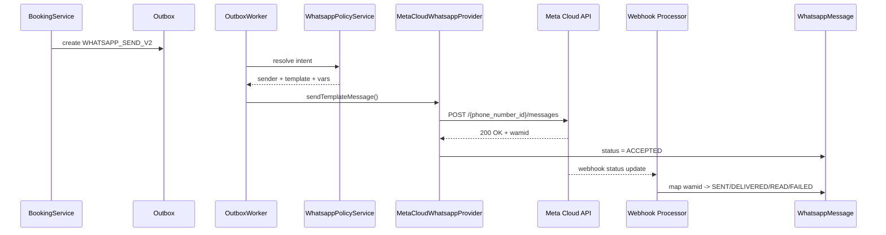
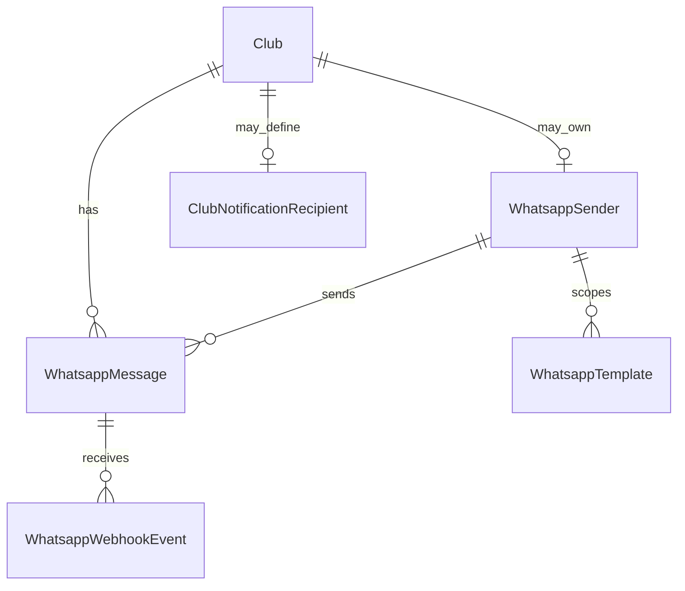

# Migracion a WhatsApp Cloud API

## Estado del documento

- Proyecto: `Pique`
- Dominio: mensajeria transaccional por WhatsApp
- Fecha de revision: `2026-06-01`
- Estado: decision de arquitectura + spec implementable de MVP

## 1. Resumen ejecutivo

Pique debe migrar de la automatizacion actual basada en WhatsApp Web hacia la `WhatsApp Cloud API` oficial de Meta.

La decision busca reducir el riesgo operativo sobre el numero de WhatsApp, mejorar trazabilidad de entrega, evitar dependencias en QR/sesiones de navegador y dejar la plataforma preparada para una evolucion futura hacia multiples senders.

Decision central:

- migrar a `WhatsApp Cloud API`
- usar en el MVP un numero central de `Pique`
- modelar desde el inicio una arquitectura `multi-sender ready`
- mantener en el MVP los mensajes transaccionales ya existentes tanto hacia clientes como hacia el club/staff

## 2. Diagnostico del estado actual

Hoy el repo ya tiene una capa de abstraccion minima y un flujo async reutilizable, pero el transporte real depende de una implementacion no oficial.

### Evidencia en el codigo actual

- `apps/wpp-service/index.js`: servicio Express separado con `whatsapp-web.js`, QR y Chromium
- `apps/backend/src/services/WhatsappService.ts`: cliente local con `LocalAuth`, QR, `webVersionCache` remoto y manejo de errores de navegador
- `apps/backend/src/services/WhatsappDeliveryService.ts`: abstraccion backend que decide el provider
- `apps/backend/src/services/OutboxWorker.ts`: worker que consume `WHATSAPP_SEND`
- `apps/backend/src/services/BookingService.ts`: genera mensajes de reserva creada y cancelada tanto para cliente como para club
- `apps/backend/src/services/PendingBookingAutoCancelService.ts`: genera warning previo a autocancelacion para cliente

### Limitaciones del enfoque actual

- depende de una sesion de WhatsApp Web autenticada por QR
- depende de Chromium/Puppeteer y de estabilidad de `whatsapp-web.js`
- no usa la plataforma oficial de business messaging
- mezcla preocupaciones de sesion de navegador con mensajeria de producto
- no expone estados oficiales de entrega y lectura via webhooks del proveedor
- deja a Pique expuesto a roturas por cambios de WhatsApp Web

## 3. Objetivos de la migracion

- usar la API oficial soportada por Meta
- conservar la funcionalidad transaccional ya existente
- evitar perder mensajes al cliente y al club durante la transicion
- desacoplar el dominio de reservas del proveedor concreto
- dejar listo el modelo para soportar senders por club en el futuro
- registrar estados de envio, entrega, lectura y fallo de forma auditable

## 4. No objetivos del MVP

- inbox conversacional dentro de Pique
- bot de atencion
- respuestas inbound procesadas por negocio
- campanas o marketing masivo
- flows avanzados
- numero propio por club
- bandeja compartida de agentes

## 5. Decision de producto y arquitectura

### 5.1 Decision principal

El MVP debe usar un numero central de `Pique` sobre `WhatsApp Cloud API`.

### 5.2 Decision de evolucion

Aunque el MVP use un unico sender central, el modelo de datos y contratos deben soportar que en el futuro un club pueda operar con su propio numero sin reescribir el flujo principal.

### 5.3 Decision sobre alcance funcional

No se deben quitar mensajes existentes al club/staff.

El MVP debe cubrir:

- mensajes transaccionales a clientes/jugadores
- mensajes transaccionales al club/staff cuando hoy ya existen

Queda explicitamente fuera del MVP el uso de WhatsApp como canal operativo conversacional del staff.

## 6. Cobertura funcional del MVP

### 6.1 Destinatarios

Definir al menos estos roles:

- `CUSTOMER`
- `CLUB_STAFF`

### 6.2 Eventos cubiertos

Mensajes a `CUSTOMER`:

- reserva registrada/creada
- reserva cancelada
- warning de reserva pendiente/autocancelacion

Mensajes a `CLUB_STAFF`:

- nueva reserva creada
- reserva cancelada
- alertas operativas equivalentes a las existentes hoy

### 6.3 Fuera de alcance funcional

- mensajes de soporte humano bidireccional
- mensajes manuales arbitrarios desde admin
- recordatorios comerciales o promocionales
- campanas de reactivacion

## 7. Modelo de sender

### 7.1 MVP

En el MVP, todos los mensajes salen por un sender central de `Pique`.

Propuesta de clave de sender:

```text
PIQUE_DEFAULT
```

### 7.2 Futuro

Un club podra tener un sender propio mas adelante.

Por eso, ningun mensaje debe depender implicitamente de “el numero global actual”. El sender debe resolverse por politica.

### 7.3 Regla de resolucion inicial

Para v1:

- siempre resolver `senderKey = PIQUE_DEFAULT`

Para v2 futura:

- si el club tiene sender propio activo, usarlo
- si no, usar `PIQUE_DEFAULT`

### 7.4 Destinatarios del club en MVP

Para no perder funcionalidad existente ni forzar una migracion de configuracion paralela, el MVP debe respetar el esquema simple actual:

```text
club.whatsappNotificationPhone
```

Regla MVP:

- si el club tiene `whatsappNotificationPhone`, los mensajes `CLUB_STAFF` se envian ahi
- si el club no tiene numero configurado, el evento `CLUB_STAFF` no debe bloquear la operacion principal
- la ausencia de destinatario staff debe registrarse como condicion operativa visible

### 7.5 Evolucion prevista para staff

La spec debe dejar previsto un modelo mas prolijo para futura expansion a multiples destinatarios por club:

```prisma
model ClubNotificationRecipient {
  id                        String   @id @default(cuid())
  clubId                    Int
  name                      String
  phone                     String
  role                      String?
  enabled                   Boolean  @default(true)
  receivesBookingCreated    Boolean  @default(true)
  receivesBookingCancelled  Boolean  @default(true)
  receivesPendingWarning    Boolean  @default(true)
  createdAt                 DateTime @default(now()) @db.Timestamptz(3)
  updatedAt                 DateTime @updatedAt @db.Timestamptz(3)
}
```

Decision:

- no implementar esta tabla en el MVP si hoy ya existe un numero unico por club
- si se implementa despues, debe convivir con migracion desde `club.whatsappNotificationPhone`

## 8. Integracion oficial objetivo

La integracion debe modelarse sobre los conceptos oficiales de Meta/WhatsApp Business Platform:

- `WABA`
- business phone number
- `phone_number_id`
- token de acceso
- permiso `whatsapp_business_messaging`
- endpoint `/{phone_number_id}/messages`
- templates
- webhooks de mensajes y estados

## 9. Estrategia de mensajeria para MVP

### 9.1 Regla principal

Para reducir ambiguedad operativa y de compliance, el MVP debe tratar todos los mensajes automatizados salientes como mensajes template.

Esto aplica tanto a `CUSTOMER` como a `CLUB_STAFF`.

### 9.2 Motivo

- simplifica el comportamiento del sistema
- evita depender de la ventana conversacional para notificaciones automaticas
- facilita trazabilidad y aprobacion previa
- reduce decisiones ad hoc por tipo de evento

### 9.3 Optimizacion futura

Mas adelante se podra optimizar y usar mensajes libres dentro de la ventana de servicio si hay un caso claro y medible. No es necesario para el MVP.

## 10. Templates iniciales del MVP

Propuesta de templates utility iniciales:

| Template key | Destinatario | Evento |
| --- | --- | --- |
| `customer_booking_created_v1` | `CUSTOMER` | reserva creada |
| `customer_booking_cancelled_v1` | `CUSTOMER` | reserva cancelada |
| `customer_booking_pending_warning_v1` | `CUSTOMER` | warning pre autocancelacion |
| `staff_booking_created_v1` | `CLUB_STAFF` | nueva reserva |
| `staff_booking_cancelled_v1` | `CLUB_STAFF` | reserva cancelada |
| `staff_booking_pending_warning_v1` | `CLUB_STAFF` | warning operativo pre autocancelacion |

Regla:

- no usar un template generico compartido entre cliente y staff
- aunque el texto sea parecido, cada template representa una intencion distinta de producto
- `CUSTOMER` recibe confirmaciones y avisos
- `CLUB_STAFF` recibe alertas operativas

### 10.1 Variables sugeridas

`customer_booking_created_v1`:

- `club_name`
- `client_name`
- `date`
- `time`
- `court_name`
- `amount`
- `club_whatsapp_url`

`staff_booking_created_v1`:

- `club_name`
- `client_name`
- `client_phone`
- `date`
- `time`
- `court_name`
- `amount`

`customer_booking_cancelled_v1`:

- `club_name`
- `client_name`
- `date`
- `time`
- `court_name`
- `club_whatsapp_url`
- `cancel_reason_label`

`staff_booking_cancelled_v1`:

- `club_name`
- `client_name`
- `client_phone`
- `date`
- `time`
- `court_name`
- `cancel_reason_label`

`customer_booking_pending_warning_v1`:

- `club_name`
- `client_name`
- `date`
- `time`
- `court_name`
- `cancel_minutes_before`
- `insufficient_amount`

`staff_booking_pending_warning_v1`:

- `club_name`
- `client_name`
- `client_phone`
- `date`
- `time`
- `court_name`
- `cancel_minutes_before`
- `insufficient_amount`

## 11. Regla de versionado de templates

Los templates deben versionarse en la clave y no mutarse silenciosamente.

Ejemplo:

```text
customer_booking_created_v1
customer_booking_created_v2
```

## 12. Arquitectura objetivo

### 12.1 Capas

- dominio: decide que mensaje hay que enviar
- outbox: persiste la intencion de envio
- policy: resuelve sender, template y locale
- provider gateway: habla con `WhatsApp Cloud API`
- webhook processor: recibe estados del proveedor

### 12.2 Regla de desacople

`BookingService` y servicios de negocio no deben conocer:

- `phone_number_id`
- tokens
- endpoints HTTP de Meta
- payloads crudos del proveedor

Solo deben producir una intencion de mensaje.

## 13. Modelo de datos propuesto

### 13.1 Sender

```prisma
model WhatsappSender {
  id                    String   @id @default(cuid())
  key                   String   @unique
  scopeType             String   // PLATFORM | CLUB
  clubId                Int?
  displayName           String
  phoneNumber           String
  phoneNumberId         String
  wabaId                String
  businessAccountId     String?
  provider              String   @default("META_CLOUD_API")
  status                String   // DRAFT | ACTIVE | PAUSED | DISABLED
  isDefault             Boolean  @default(false)
  accessTokenRef        String?
  webhookVerifyTokenRef String?
  createdAt             DateTime @default(now()) @db.Timestamptz(3)
  updatedAt             DateTime @updatedAt @db.Timestamptz(3)
}
```

### 13.2 Template catalog

```prisma
model WhatsappTemplate {
  id              String   @id @default(cuid())
  senderId        String?
  sender          WhatsappSender? @relation(fields: [senderId], references: [id], onDelete: SetNull)
  key             String
  providerName    String
  language        String
  category        String   // UTILITY | MARKETING | AUTHENTICATION
  status          String   // DRAFT | PENDING | APPROVED | REJECTED | PAUSED
  bodyPreview     String?
  createdAt       DateTime @default(now()) @db.Timestamptz(3)
  updatedAt       DateTime @updatedAt @db.Timestamptz(3)

  @@unique([senderId, key, language])
}
```

### 13.3 Message log

```prisma
model WhatsappMessage {
  id                   String   @id @default(cuid())
  clubId               Int?
  senderId             String
  sender               WhatsappSender @relation(fields: [senderId], references: [id], onDelete: Restrict)
  recipientRole        String   // CUSTOMER | CLUB_STAFF
  recipientPhone       String
  templateKey          String?
  locale               String?
  messageType          String   // TEMPLATE | TEXT
  direction            String   @default("OUTBOUND")
  conversationCategory String?  // UTILITY | MARKETING | AUTHENTICATION | SERVICE
  status               String   // QUEUED | ACCEPTED | SENT | DELIVERED | READ | FAILED | DROPPED
  providerMessageId    String?  @unique
  dedupeKey            String?
  referenceType        String?  // BOOKING | ACCOUNT | SYSTEM
  referenceId          String?
  requestPayload       Json?
  responsePayload      Json?
  lastWebhookPayload   Json?
  errorCode            String?
  errorMessage         String?
  createdAt            DateTime @default(now()) @db.Timestamptz(3)
  sentAt               DateTime? @db.Timestamptz(3)
  deliveredAt          DateTime? @db.Timestamptz(3)
  readAt               DateTime? @db.Timestamptz(3)
  failedAt             DateTime? @db.Timestamptz(3)
  updatedAt            DateTime @updatedAt @db.Timestamptz(3)

  @@index([clubId, status, createdAt])
  @@index([referenceType, referenceId])
  @@index([recipientRole, recipientPhone])
}
```

### 13.4 Webhook events

```prisma
model WhatsappWebhookEvent {
  id                String   @id @default(cuid())
  senderId          String?
  providerEventId   String?
  eventType         String
  payload           Json
  processedAt       DateTime?
  processingStatus  String   // PENDING | PROCESSED | IGNORED | FAILED
  errorMessage      String?
  createdAt         DateTime @default(now()) @db.Timestamptz(3)

  @@index([processingStatus, createdAt])
  @@index([providerEventId])
}
```

## 14. Contrato de outbox propuesto

El evento viejo `WHATSAPP_SEND` hoy transporta solo:

```ts
{ phone, message }
```

Eso no alcanza para Cloud API.

### 14.1 Nuevo tipo sugerido

```text
WHATSAPP_SEND_V2
```

### 14.2 Payload sugerido

```ts
type WhatsappSendV2Payload = {
  clubId?: number | null;
  senderKey: string;
  recipientRole: 'CUSTOMER' | 'CLUB_STAFF';
  to: string;
  messageIntent:
    | {
        kind: 'TEMPLATE';
        templateKey: string;
        locale: string;
        variables: Record<string, string>;
      }
    | {
        kind: 'TEXT';
        text: string;
      };
  referenceType: 'BOOKING' | 'ACCOUNT' | 'SYSTEM';
  referenceId: string;
  dedupeKey: string;
};
```

### 14.3 Decision de MVP

Para MVP, `messageIntent.kind` debe ser `TEMPLATE` para todos los mensajes automaticos.

## 15. Adaptacion del flujo actual

### 15.1 Booking created

El flujo actual genera:

- mensaje al cliente
- mensaje al club
- notificacion interna

En la migracion debe conservarse la misma semantica, pero transformar los mensajes en templates aprobados.

### 15.2 Booking cancelled

Debe mantener:

- mensaje al cliente
- mensaje al club
- notificacion interna

### 15.3 Pending warning

Debe mantener:

- warning por WhatsApp al cliente
- notificacion interna si ya existe el caso de uso

## 16. Provider gateway

### 16.1 Servicio sugerido

```ts
export interface WhatsappProviderGateway {
  sendTemplateMessage(input: SendTemplateMessageInput): Promise<SendTemplateMessageResult>;
  sendTextMessage(input: SendTextMessageInput): Promise<SendTextMessageResult>;
}
```

### 16.2 Implementacion concreta de MVP

```ts
export class MetaCloudWhatsappProvider implements WhatsappProviderGateway {
  // resuelve sender
  // llama POST /{phone_number_id}/messages
  // persiste request/response
}
```

## 17. Webhooks

### 17.1 Objetivo

Recibir desde Meta:

- aceptacion del mensaje
- enviado
- entregado
- leido
- fallo

### 17.2 Endpoint sugerido

```text
GET  /api/whatsapp/webhooks/meta
POST /api/whatsapp/webhooks/meta
```

### 17.3 Reglas

- validar token de verificacion
- persistir payload crudo
- procesar idempotentemente
- actualizar `WhatsappMessage.status`
- no asumir orden perfecto de llegada

## 18. Estados internos recomendados

| Estado | Significado |
| --- | --- |
| `QUEUED` | encolado localmente |
| `ACCEPTED` | estado interno luego de que la API de Meta responde OK al request inicial |
| `SENT` | estado posterior que indica que el mensaje fue procesado/enviado por el proveedor |
| `DELIVERED` | entregado al destinatario |
| `READ` | leido por el destinatario |
| `FAILED` | fallo terminal |
| `DROPPED` | expirado o descartado |

Regla importante:

- `ACCEPTED` no debe modelarse como si fuera necesariamente un webhook del proveedor
- `ACCEPTED` representa aceptacion tecnica del request por la API
- `SENT`, `DELIVERED`, `READ` y `FAILED` pueden provenir del procesamiento posterior y/o de webhooks

## 19. Politica de errores

Clasificaciones minimas:

- error de configuracion
- error de validacion de payload
- rate limit
- template inexistente o no aprobado
- numero invalido
- provider unavailable
- webhook no procesado

### Reglas

- no reintentar ciegamente errores funcionales
- reintentar con backoff errores transitorios
- exponer `errorCode` y `errorMessage`
- permitir desactivar el canal sin romper el negocio principal

## 20. Feature flags sugeridas

```text
ENABLE_WHATSAPP_CLOUD_API=false
ENABLE_WHATSAPP_TEMPLATES=false
ENABLE_WHATSAPP_WEBHOOK_PROCESSOR=false
ENABLE_WHATSAPP_LEGACY_WPP=false
```

### Regla de rollout

Durante la migracion:

- mantener `legacy` y `cloud` coexistiendo por feature flag
- nunca activar ambos para el mismo flujo sin estrategia de deduplicacion explicita

## 21. Variables de entorno futuras sugeridas

Variables globales MVP:

- `WHATSAPP_PROVIDER=meta_cloud_api`
- `WHATSAPP_GRAPH_API_BASE_URL=https://graph.facebook.com`
- `WHATSAPP_GRAPH_API_VERSION=v19.0` o version vigente
- `WHATSAPP_DEFAULT_SENDER_KEY=PIQUE_DEFAULT`
- `WHATSAPP_META_ACCESS_TOKEN=...`
- `WHATSAPP_META_WEBHOOK_VERIFY_TOKEN=...`
- `ENABLE_WHATSAPP_CLOUD_API=false`
- `ENABLE_WHATSAPP_TEMPLATES=false`
- `ENABLE_WHATSAPP_WEBHOOK_PROCESSOR=false`

Estas variables representan la direccion objetivo. No deben sobreescribir silenciosamente la operacion actual hasta que exista implementacion real.

## 22. Observabilidad

Medir al menos:

- mensajes encolados
- mensajes aceptados
- entregados
- leidos
- fallidos
- latencia `queue -> accepted`
- latencia `accepted -> delivered`
- fallos por template
- fallos por sender

## 23. Seguridad y compliance

- no loguear access tokens
- no loguear payloads sensibles completos en texto plano
- cifrar referencias secretas si se persisten
- separar secretos de sender del dominio de reservas
- guardar solo lo necesario para auditoria

## 24. Plan de rollout

### Etapa 1. Documentacion y contratos

- cerrar decision de producto
- crear schema futuro
- crear contratos `WHATSAPP_SEND_V2`

### Etapa 2. Infraestructura provider

- implementar `MetaCloudWhatsappProvider`
- alta de sender central
- webhook verification

### Etapa 3. Templates

- registrar y aprobar templates MVP
- validar variables

### Etapa 4. Integracion backend

- generar `WHATSAPP_SEND_V2`
- mantener fallback legacy bajo flag

### Etapa 5. Shadow mode

- enviar a cloud en entorno controlado
- verificar accepted/delivered/read
- no cortar funcionalidad existente hasta estabilizar

### Etapa 6. Cutover

- activar `ENABLE_WHATSAPP_CLOUD_API`
- apagar `wpp-service` para esos flujos
- mantener rollback simple

## 25. Rollback

Si la salida a Cloud API falla:

- desactivar `ENABLE_WHATSAPP_CLOUD_API`
- reactivar provider legacy solo si sigue siendo operable y aceptable para contingencia
- si no, dejar el canal WhatsApp apagado y conservar notificaciones internas

## 26. Riesgos principales

- templates no aprobados a tiempo
- sender mal configurado
- numeros mal normalizados
- falsa asuncion de que todos los mensajes se comportan igual
- dependencia de mensajes al staff no modelada correctamente
- duplicados si conviven dos providers sin estrategia clara

## 27. Decisiones futuras ya previstas

- sender propio por club
- mensajes inbound
- inbox operacional
- bot y automatizaciones conversacionales
- campanas y marketing
- localizacion por idioma
- soporte multimedia

## 28. Criterio de listo para implementar

La documentacion se considera suficientemente cerrada cuando:

- el MVP conserva mensajes a cliente y al club ya existentes
- el contrato de outbox ya no depende de `phone + message`
- hay un modelo de sender y message log definidos
- hay templates iniciales identificados
- hay webhook y estados internos definidos
- existe estrategia de rollout y rollback

## 29. Fuentes oficiales

- [WhatsApp Cloud API Overview](https://meta-preview.mintlify.io/docs/whatsapp/cloud-api/overview)
- [WhatsApp Cloud API Get Started](https://meta-preview.mintlify.io/docs/whatsapp/cloud-api/get-started)
- [Add a Phone Number](https://meta-preview.mintlify.io/docs/whatsapp/cloud-api/get-started/add-a-phone-number)
- [Sending Messages](https://meta-preview.mintlify.io/docs/whatsapp/cloud-api/guides/send-messages)
- [Send Message Templates](https://meta-preview.mintlify.io/docs/whatsapp/cloud-api/guides/send-message-templates)
- [WhatsApp message templates overview](https://developers.facebook.com/docs/whatsapp/message-templates/)

## 30. Cierre

La migracion recomendada para `Pique` es hacia `WhatsApp Cloud API` oficial, con numero central de plataforma en el MVP y arquitectura lista para evolucionar a multi-sender. La migracion no debe quitar mensajes transaccionales existentes al club/staff. El diseño debe conservar la abstraccion y el outbox actuales, pero reemplazar el transporte legado por un provider oficial, con templates, webhooks y trazabilidad completa.

## 31. Ejemplos reales de texto por template

Los textos de ejemplo siguientes son base funcional para negocio y producto. Antes de produccion deben adaptarse al naming y copy final aprobado en WhatsApp Manager.

### 31.1 `customer_booking_created_v1`

```text
Hola {{client_name}}, tu reserva en {{club_name}} quedó confirmada.
Dia: {{date}}
Hora: {{time}}
Cancha: {{court_name}}
Importe: {{amount}}
Si necesitás ayuda, escribinos acá: {{club_whatsapp_url}}
```

### 31.2 `customer_booking_cancelled_v1`

```text
Hola {{client_name}}, tu reserva en {{club_name}} fue cancelada.
Dia: {{date}}
Hora: {{time}}
Cancha: {{court_name}}
Motivo: {{cancel_reason_label}}
Si necesitás ayuda, escribinos acá: {{club_whatsapp_url}}
```

### 31.3 `customer_booking_pending_warning_v1`

```text
Hola {{client_name}}, tu reserva en {{club_name}} sigue pendiente.
Dia: {{date}}
Hora: {{time}}
Cancha: {{court_name}}
Importe pendiente: {{insufficient_amount}}
Si no se completa el pago, puede cancelarse en {{cancel_minutes_before}} minutos.
```

### 31.4 `staff_booking_created_v1`

```text
Nueva reserva en {{club_name}}.
Cliente: {{client_name}}
Telefono: {{client_phone}}
Dia: {{date}}
Hora: {{time}}
Cancha: {{court_name}}
Importe: {{amount}}
```

### 31.5 `staff_booking_cancelled_v1`

```text
Reserva cancelada en {{club_name}}.
Cliente: {{client_name}}
Telefono: {{client_phone}}
Dia: {{date}}
Hora: {{time}}
Cancha: {{court_name}}
Motivo: {{cancel_reason_label}}
```

### 31.6 `staff_booking_pending_warning_v1`

```text
Reserva pendiente por revisar en {{club_name}}.
Cliente: {{client_name}}
Telefono: {{client_phone}}
Dia: {{date}}
Hora: {{time}}
Cancha: {{court_name}}
Importe pendiente: {{insufficient_amount}}
Autocancelacion estimada en {{cancel_minutes_before}} minutos.
```

## 32. Ejemplos JSON request/response de Meta

Los ejemplos siguientes son representativos del shape esperado segun la documentacion oficial de `Cloud API`. Deben ajustarse a la version real del Graph API y al nombre exacto del template aprobado.

### 32.1 Request de envio template

```json
POST /v19.0/{phone_number_id}/messages
{
  "messaging_product": "whatsapp",
  "recipient_type": "individual",
  "to": "5491123456789",
  "type": "template",
  "template": {
    "name": "customer_booking_created_v1",
    "language": {
      "code": "es_AR"
    },
    "components": [
      {
        "type": "body",
        "parameters": [
          { "type": "text", "text": "Juan" },
          { "type": "text", "text": "Pique Club" },
          { "type": "text", "text": "2026-06-03" },
          { "type": "text", "text": "19:00" },
          { "type": "text", "text": "Cancha 2" },
          { "type": "text", "text": "$18.000" },
          { "type": "text", "text": "https://wa.me/5491100000000" }
        ]
      }
    ]
  }
}
```

### 32.2 Response inicial aceptada por API

```json
{
  "messaging_product": "whatsapp",
  "contacts": [
    {
      "input": "5491123456789",
      "wa_id": "5491123456789"
    }
  ],
  "messages": [
    {
      "id": "wamid.HBgL..."
    }
  ]
}
```

Interpretacion:

- si la API responde OK y devuelve `messages[0].id`, Pique debe pasar el mensaje a estado `ACCEPTED`
- `ACCEPTED` no implica todavia `DELIVERED`

### 32.3 Ejemplo de webhook de status

```json
{
  "object": "whatsapp_business_account",
  "entry": [
    {
      "id": "WABA_ID",
      "changes": [
        {
          "field": "messages",
          "value": {
            "messaging_product": "whatsapp",
            "metadata": {
              "phone_number_id": "PHONE_NUMBER_ID"
            },
            "statuses": [
              {
                "id": "wamid.HBgL...",
                "status": "delivered",
                "timestamp": "1717200000",
                "recipient_id": "5491123456789"
              }
            ]
          }
        }
      ]
    }
  ]
}
```

Interpretacion:

- buscar `WhatsappMessage.providerMessageId = statuses[].id`
- mapear `status` a estado interno
- persistir payload crudo para auditoria

## 33. Secuencia end-to-end

### 33.1 Flujo narrado

1. `BookingService` confirma o actualiza una reserva.
2. Servicio de negocio decide que corresponde mensaje a `CUSTOMER`, `CLUB_STAFF` o ambos.
3. Backend persiste eventos `WHATSAPP_SEND_V2` en outbox.
4. `OutboxWorker` consume evento y resuelve `senderKey`.
5. `WhatsappPolicyService` define `templateKey`, `locale` y variables.
6. `MetaCloudWhatsappProvider` normaliza telefono y llama `POST /{phone_number_id}/messages`.
7. Si la API responde OK, Pique crea/actualiza `WhatsappMessage` en `ACCEPTED`.
8. Meta envia webhooks de estado.
9. `WhatsappWebhookProcessor` resuelve `providerMessageId` y actualiza `SENT`, `DELIVERED`, `READ` o `FAILED`.
10. Backoffice y observabilidad muestran trazabilidad completa.

### 33.2 Diagrama de secuencia



## 34. Matriz evento -> destinatario -> template -> variables

| Evento | Destinatario | Template | Variables minimas |
| --- | --- | --- | --- |
| `BOOKING_CREATED` | `CUSTOMER` | `customer_booking_created_v1` | `client_name`, `club_name`, `date`, `time`, `court_name`, `amount`, `club_whatsapp_url` |
| `BOOKING_CREATED` | `CLUB_STAFF` | `staff_booking_created_v1` | `club_name`, `client_name`, `client_phone`, `date`, `time`, `court_name`, `amount` |
| `BOOKING_CANCELLED` | `CUSTOMER` | `customer_booking_cancelled_v1` | `client_name`, `club_name`, `date`, `time`, `court_name`, `club_whatsapp_url`, `cancel_reason_label` |
| `BOOKING_CANCELLED` | `CLUB_STAFF` | `staff_booking_cancelled_v1` | `club_name`, `client_name`, `client_phone`, `date`, `time`, `court_name`, `cancel_reason_label` |
| `BOOKING_PENDING_WARNING` | `CUSTOMER` | `customer_booking_pending_warning_v1` | `client_name`, `club_name`, `date`, `time`, `court_name`, `cancel_minutes_before`, `insufficient_amount` |
| `BOOKING_PENDING_WARNING` | `CLUB_STAFF` | `staff_booking_pending_warning_v1` | `club_name`, `client_name`, `client_phone`, `date`, `time`, `court_name`, `cancel_minutes_before`, `insufficient_amount` |

## 35. Checklist operativo de onboarding de sender central

### 35.1 Alta tecnica

- crear o identificar `WABA` de Pique
- registrar business phone number
- obtener `phone_number_id`
- obtener `WHATSAPP_META_ACCESS_TOKEN`
- configurar `WHATSAPP_META_WEBHOOK_VERIFY_TOKEN`
- configurar webhook en app de Meta
- suscribirse a eventos de mensajes

### 35.2 Alta funcional

- definir display name final
- aprobar templates MVP
- validar idioma `es_AR` o locale definitivo
- validar textos legales/comerciales
- definir owner operativo del numero

### 35.3 Validacion previa

- enviar template test a numero interno
- validar `ACCEPTED`
- validar webhook `SENT`
- validar webhook `DELIVERED`
- validar webhook `READ`
- validar fallback de `FAILED`
- validar visibilidad de estado en backoffice

## 36. Catalogo de errores Meta -> accion interna

La fuente de verdad tecnica siempre debe ser `errorCode`, `errorMessage` y payload real del proveedor. La tabla siguiente define la accion esperada de Pique por categoria.

| Categoria | Ejemplo de situacion | Accion interna |
| --- | --- | --- |
| auth invalid | token vencido, token invalido, permiso faltante | marcar `FAILED`, generar incidente tecnico, bloquear nuevos envios hasta corregir credencial |
| sender invalid | `phone_number_id` inexistente o no asociado | marcar `FAILED`, incidente de configuracion, no reintentar ciegamente |
| template invalid | template inexistente, pausado, rechazado o locale no aprobado | marcar `FAILED`, incidente funcional, corregir catalogo/template |
| recipient invalid | numero mal formado, no valido, no WhatsApp | marcar `FAILED`, registrar causa visible, no reintentar automaticamente |
| rate limit | limite temporal del proveedor | reintentar con backoff, emitir metrica y alerta si persiste |
| provider unavailable | timeout, `5xx`, indisponibilidad temporal | reintentar con backoff, mantener trazabilidad |
| webhook validation failed | verify token incorrecto o payload invalido | incidente tecnico critico, no avanzar rollout |
| duplicate send risk | mismo evento emitido dos veces | usar `dedupeKey`, no duplicar `WhatsappMessage`, auditar conflicto |

## 37. Policy de normalizacion de telefonos

### 37.1 Regla general

Todos los telefonos deben persistirse y enviarse en formato `E.164` sin espacios ni separadores visuales.

Ejemplo:

```text
5491123456789
```

### 37.2 Pipeline sugerido

1. trim del input
2. remover espacios, parentesis y guiones
3. convertir `00` internacional inicial a formato sin prefijo visual
4. resolver codigo de pais por default del club si el numero viene local
5. validar largo minimo y maximo
6. persistir:
   - `rawPhoneInput`
   - `normalizedPhoneE164`

### 37.3 Regla para Argentina

Si el producto hoy opera principalmente en Argentina:

- usar `54` como country code por default cuando aplique
- contemplar moviles con `9`
- no hardcodear reglas irreversibles dentro del dominio de reservas
- encapsular normalizacion en `PhoneNormalizationService`

## 38. Diagrama de tablas y relaciones



Lectura:

- `WhatsappSender` define origen de salida
- `WhatsappTemplate` define catalogo utilizable por sender
- `WhatsappMessage` registra intento, respuesta y estados
- `WhatsappWebhookEvent` guarda trazabilidad cruda del proveedor
- `ClubNotificationRecipient` queda documentado como evolucion futura

## 39. Shadow mode plan con metricas objetivo

### 39.1 Objetivo

Validar provider oficial sin cortar operacion existente hasta comprobar estabilidad.

### 39.2 Regla de operacion

- generar eventos `WHATSAPP_SEND_V2`
- enviar por Cloud API solo para numeros internos o entorno controlado
- mantener canal legacy o canal manual como respaldo
- no activar rollout masivo si faltan webhooks estables

### 39.3 Metricas objetivo iniciales

- `api_acceptance_rate >= 99%`
- `webhook_match_rate >= 99%`
- `delivered_rate` consistente con baseline real del negocio
- `failed_rate < 2%` por causas no funcionales
- `duplicate_rate = 0`
- `orphan_webhook_rate = 0`

### 39.4 Criterio de salida de shadow mode

- templates MVP aprobados
- sender central estable
- phone normalization estable
- match confiable por `providerMessageId`
- panel operativo usable para soporte

## 40. Smoke test checklist para QA

### 40.1 Booking created

- crear reserva confirmada
- verificar outbox `WHATSAPP_SEND_V2`
- verificar `customer_booking_created_v1`
- verificar `staff_booking_created_v1`
- verificar `ACCEPTED`
- verificar webhook posterior

### 40.2 Booking cancelled

- cancelar reserva existente
- verificar `customer_booking_cancelled_v1`
- verificar `staff_booking_cancelled_v1`
- verificar deduplicacion si hay retry manual

### 40.3 Pending warning

- generar caso de reserva pendiente
- verificar `customer_booking_pending_warning_v1`
- verificar `staff_booking_pending_warning_v1` solo si negocio lo habilita
- verificar que warning no bloquee flujo principal

### 40.4 Errores y contingencia

- template faltante
- numero invalido
- sender deshabilitado
- webhook con token invalido
- timeout del provider
- rollback por feature flag

### 40.5 Validaciones de trazabilidad

- un `WhatsappMessage` por envio efectivo
- `providerMessageId` persistido
- timestamps `accepted/sent/delivered/read/failed` coherentes
- payload crudo disponible para auditoria
- dedupeKey respetado

## 41. Principios de experiencia WhatsApp

La migracion no debe pensarse solo como reemplazo tecnico del transporte. Debe elevar la experiencia percibida por clientes y clubes.

Principios rectores:

- rapidez: el mensaje debe llegar cerca del momento relevante
- claridad: el texto debe decir que paso, cuando, donde y que hacer
- accionabilidad: cada mensaje debe orientar a una accion concreta o dejar claro que no hace falta actuar
- contexto: incluir datos suficientes para evitar preguntas innecesarias
- bajo ruido: no mandar mas mensajes de los necesarios
- consistencia: mismo evento, mismo criterio, mismo tono

## 42. Diseño conversacional por evento

### 42.1 Cliente

Tono esperado:

- claro
- confiable
- corto
- amable
- orientado a resolver

Reglas:

- abrir con el hecho principal
- poner fecha/hora/cancha en bloques faciles de leer
- cerrar con CTA o canal de ayuda
- no usar texto legal o tecnico innecesario

### 42.2 Staff del club

Tono esperado:

- operativo
- rapido
- directo
- escaneable

Reglas:

- poner primero el tipo de evento
- incluir cliente y telefono
- evitar texto de marketing
- facilitar accion inmediata

## 43. CTAs y deep links

Cada mensaje importante debe evaluar CTA util. No todos los templates necesitan boton, pero todos deben pensarse con accion de siguiente paso.

CTAs sugeridos:

- `Ver reserva`
- `Pagar saldo`
- `Contactar al club`
- `Abrir panel`

Deep links sugeridos:

- link a detalle de reserva del cliente
- link a checkout o saldo pendiente
- `wa.me` del club
- link interno del admin para staff

Regla:

- no mandar links rotos o genericos
- todo CTA debe medirse

## 44. Fallback multicanal

Si WhatsApp falla, experiencia no debe romperse.

Fallbacks posibles:

- email transaccional
- push notification
- notificacion in-app
- alerta interna en backoffice

Politica recomendada:

- cliente: intentar fallback segun preferencia y criticidad
- staff: fallback minimo a notificacion interna/backoffice
- incidentes criticos: crear incidente visible aunque falle todo canal saliente

## 45. Preferencias del usuario

Para elevar valor real, el sistema debe poder evolucionar a preferencias por usuario y por club.

Campos futuros sugeridos:

```text
UserNotificationPreference {
  userId
  whatsappEnabled
  emailEnabled
  pushEnabled
  preferredChannel
  locale
  timezone
  quietHoursStart
  quietHoursEnd
}
```

Uso esperado:

- respetar idioma preferido
- evitar mensajes en horarios no deseados
- elegir fallback correcto
- personalizar experiencia sin reescribir negocio

## 46. Reglas de frecuencia y anti-spam

WhatsApp valioso requiere disciplina. No solo entregar. No molestar.

Reglas base:

- no mandar dos confirmaciones por mismo evento
- no mandar warning repetido sin cambio material
- no reenviar cancelacion salvo accion humana o cambio real
- agrupar eventos menores si aparecen en ventana corta
- respetar `dedupeKey` funcional y tambien dedupe UX

Ejemplos:

- si booking cambia dos veces en 30 segundos, consolidar
- si warning ya fue enviado para misma reserva y mismo umbral, no repetir
- si staff ya fue alertado, no spamear multiples destinatarios sin criterio

## 47. Métricas de experiencia

No alcanza con medir `delivery`.

Métricas UX sugeridas:

- tiempo desde evento hasta `ACCEPTED`
- tiempo desde evento hasta `DELIVERED`
- tasa de lectura
- tasa de accion post mensaje
- tasa de pago luego de warning
- tasa de contacto al club luego de cancelacion
- reducción de soporte manual
- reducción de no-shows
- satisfacción operativa del club

Métricas de producto premium:

- reservas salvadas por warning
- cobranzas recuperadas
- tiempo ahorrado al staff
- tasa de adopcion del canal

## 48. Escalamiento a humano

Cuando mensaje automatico no alcanza, sistema debe saber salir elegantemente.

Casos:

- cliente responde por otro canal
- cliente no paga luego de warning
- staff necesita intervenir manualmente
- hay conflicto o duda con reserva

Acciones sugeridas:

- crear tarea o incidente interno
- mostrar banner en panel
- ofrecer CTA a contacto humano
- registrar que automatizacion no resolvio el caso

## 49. Política de branding y confianza

La percepcion del mensaje cambia mucho segun sender, display name y consistencia visual/textual.

Definir:

- display name oficial de `Pique`
- convención de firma de mensajes
- convención de naming de templates
- lineamientos de tono
- reglas de uso de nombre del club dentro del cuerpo

Objetivo:

- que el cliente entienda rapido que mensaje es legitimo
- que el club sienta que el sistema le agrega valor, no ruido

## 50. Backoffice de operación humana

Para experiencia premium, staff necesita control.

Capacidades futuras sugeridas:

- ver historial de mensajes por reserva
- ver estado por destinatario
- reenviar manualmente con permiso
- ver error legible
- cambiar numero staff del club
- pausar canal por club
- ver métricas de entregabilidad y lectura

## 51. Roadmap premium de alto valor

Una vez estable el MVP transaccional, la capa premium puede crecer sobre misma arquitectura.

Items de mayor valor:

- reminder pre-reserva
- link de pago de saldo pendiente
- aviso de liberacion de cancha
- post-partido con feedback
- recuperacion de reserva caida
- inbox operativo del club
- campañas utiles no invasivas
- automatizaciones por clima o cierre del club
- AI assistant para staff

## 52. Criterio de experiencia 100000%

La experiencia puede considerarse realmente excelente cuando:

- mensaje correcto llega a persona correcta en momento correcto
- texto se entiende en segundos
- usuario sabe que hacer despues
- club reduce trabajo manual
- sistema no genera ruido ni duplicados
- fallos no dejan al usuario sin contexto
- soporte tiene trazabilidad completa
- negocio puede medir impacto real del canal

## 53. Vision del modulo: Pique Notification Platform

Este documento no debe leerse solo como una migracion de `whatsapp-web.js` hacia `WhatsApp Cloud API`.

Debe leerse como la base del modulo:

```text
Pique Notification Platform
```

Vision:

- el dominio emite intenciones de notificacion
- la plataforma procesa esas intenciones asincronicamente
- la plataforma resuelve destinatario, canal, sender y template
- la plataforma ejecuta envio, registra estado y audita resultado
- la plataforma recibe webhooks y consolida trazabilidad
- la plataforma permite fallback, apagado controlado y operacion humana

Decision de diseño:

- `WhatsApp Cloud API` es el primer canal fuerte
- el diseño no debe quedar atado a WhatsApp como unica posibilidad futura
- el modulo debe poder crecer a otros canales sin reescribir el dominio de reservas

## 54. Principios rectores del modulo

- una reserva nunca falla porque fallo una notificacion
- el dominio no manda WhatsApps; emite eventos o intenciones
- no se duplican mensajes
- no se mandan mensajes sin contexto
- no se molesta al usuario
- todo envio debe tener trazabilidad
- todo envio debe ser idempotente
- todo canal debe poder apagarse por feature flag
- no se hardcodea `PIQUE_DEFAULT` como unica posibilidad futura
- no se mezclan mensajes a clientes con mensajes a staff
- no se construyen features nuevas sobre `WhatsApp Web` legacy
- no se asume que `SENT` significa `DELIVERED`
- no se convierte WhatsApp en CRM dentro de este alcance

## 55. Limites que el agente no debe cruzar

Durante esta migracion, el agente no debe:

- implementar inbox conversacional
- implementar bot de reservas
- implementar campañas
- implementar marketing
- implementar AI assistant
- implementar WhatsApp Flows
- implementar numero propio por club visible en UI
- implementar onboarding self-service de `WABA` por club
- eliminar mensajes existentes al staff
- bloquear reservas si falla WhatsApp
- hardcodear textos finales en `BookingService`
- guardar tokens planos en base
- mezclar templates de `CUSTOMER` con `CLUB_STAFF`
- asumir que `SENT` significa `DELIVERED`
- crear logica nueva sobre `whatsapp-web.js`
- modificar reglas de negocio de reservas salvo lo necesario para emitir eventos
- automatizar linking `Client -> User`
- hacer merge automatico de clientes
- agregar pagos por WhatsApp dentro de esta migracion
- agregar funcionalidades premium como parte del MVP

## 56. Matriz de alcance: MVP / V1 / Future / Out of scope

### 56.1 MVP

- sender central `PIQUE_DEFAULT`
- `WHATSAPP_SEND_V2`
- `CUSTOMER` notifications
- `CLUB_STAFF` notifications existentes
- templates utility iniciales
- resolver de sender preparado para futuro
- resolver de template
- webhooks minimos
- estados internos
- feature flags
- rollout controlado
- rollback
- trazabilidad
- idempotencia
- smoke tests

### 56.2 V1 / Soon

- UI interna/admin para ver ultimos envios
- errores por club
- reenvio manual controlado
- configuracion simple por club para activar/desactivar WhatsApp
- numero operativo staff editable
- metricas basicas por club
- health check del canal

### 56.3 Future / Premium

- sender propio por club
- onboarding de `WABA` por club
- lista configurable de destinatarios staff
- preferencias de canal por usuario
- recordatorios avanzados
- links de pago
- feedback post-partido
- recuperacion de reservas caidas
- inbox staff
- bot
- AI assistant
- WhatsApp Flows

### 56.4 Out of scope

- campañas
- marketing
- CRM
- soporte conversacional
- inbox
- bot
- AI assistant
- pagos por WhatsApp
- numero propio visible por club en MVP
- automatizaciones conversacionales

## 57. Roles destinatarios: actuales y futuros

Separar roles evita mezclar tono, templates, permisos, fallback y trazabilidad.

### 57.1 Roles MVP

- `CUSTOMER`
- `BOOKING_OWNER` como alias semantico futuro del customer responsable de la reserva, sin obligar implementacion separada en MVP
- `CLUB_STAFF`

### 57.2 Roles futuros

- `BOOKING_PARTICIPANT`
- `CLUB_OWNER`
- `PROFESSOR`
- `PIQUE_ADMIN`

Regla:

- documentar roles futuros no implica implementarlos ahora
- MVP puede seguir resolviendo sobre `CUSTOMER` y `CLUB_STAFF`

## 58. Staff notifications

Los mensajes a staff no se eliminan. Hoy ya existen en el sistema y el MVP debe migrarlos.

Definicion:

- mensajes a `CLUB_STAFF` son alertas operativas
- no son mensajes al cliente
- deben tener templates separados
- deben mantener trazabilidad propia

Reglas MVP:

- pueden enviarse a un unico numero operativo del club si ese es el modelo actual
- deben poder desactivarse por club o por evento
- no deben bloquear reservas si fallan
- no deben dispararse por micro-ediciones menores

Futuro:

- lista configurable de destinatarios por club
- reglas por evento
- reglas por rol interno
- umbrales anti-ruido para clubes de alto volumen

Modelo futuro sugerido:

```ts
type ClubNotificationRecipient = {
  clubId: number;
  name: string;
  phone: string;
  role?: string;
  enabled: boolean;
  receivesBookingCreated: boolean;
  receivesBookingCancelled: boolean;
  receivesPendingWarning: boolean;
};
```

## 59. Matriz de experiencia por evento

| Event | Recipient role | Emotion | Objective | CTA | Fallback | Tone |
| --- | --- | --- | --- | --- | --- | --- |
| `BOOKING_CREATED` | `CUSTOMER` | tranquilidad | confirmar que la reserva quedo registrada o confirmada | ver reserva | email / in-app / sin fallback si no hay canal valido | claro, corto, transaccional |
| `BOOKING_CREATED` | `CLUB_STAFF` | control | avisar que entro una nueva reserva | abrir reserva en admin | notificacion interna | operativo |
| `BOOKING_CANCELLED` | `CUSTOMER` | certeza | avisar que la reserva fue cancelada | ver detalle / contactar club | email / in-app | claro |
| `BOOKING_CANCELLED` | `CLUB_STAFF` | control operativo | avisar que se libero un turno | abrir agenda / admin | notificacion interna | directo |
| `BOOKING_PENDING_WARNING` | `CUSTOMER` | urgencia moderada | avisar que la reserva puede autocancelarse | confirmar / pagar / ver reserva | no duplicar warning | corto y util |
| `BOOKING_PENDING_WARNING` | `CLUB_STAFF` | prevencion | avisar que una reserva pendiente esta por caer | abrir reserva / admin | dashboard / in-app | operativo |

## 60. Politica anti-ruido / anti-spam

Reglas obligatorias:

- no mandar dos mensajes por el mismo evento logico
- no mandar warning mas de una vez por reserva
- no mandar mensajes por cambios menores que no afectan al destinatario
- no mandar mensajes al staff por cada micro-edicion
- no duplicar mensajes entre legacy y Cloud API
- no enviar mensajes de marketing desde templates utility
- no enviar fuera de horarios razonables salvo eventos criticos, cuando en el futuro exista configuracion horaria
- permitir desactivar notificaciones por club, canal o evento
- para staff de clubes con mucho volumen, priorizar eventos importantes
- toda notificacion debe poder justificarse por un evento del sistema

## 61. Timeline de notificaciones por reserva

Vision:

- el detalle futuro de una reserva deberia poder mostrar historial de notificaciones
- esto no implica UI MVP obligatoria
- si implica guardar datos suficientes desde ahora

Ejemplo:

```text
Notificaciones

10:00 - WhatsApp CUSTOMER - reserva registrada - accepted
10:00 - WhatsApp CLUB_STAFF - nueva reserva - delivered
10:05 - WhatsApp CUSTOMER - warning pendiente - read
10:15 - WhatsApp CUSTOMER - reserva cancelada - sent
```

Decision:

- el modelo debe conservar datos para soportar esta vista en `V1` o `Future`

## 62. Backoffice operativo

### 62.1 MVP

- logs
- base de datos
- trazabilidad tecnica

### 62.2 V1 / Future

- ver ultimos envios
- ver errores
- reenviar manualmente una notificacion fallida
- desactivar WhatsApp para un club
- cambiar numero operativo del staff
- ver estado de templates
- ver estado del sender
- ver health del webhook

Regla:

- el reenvio manual debe ser controlado
- nunca debe generar spam accidental

## 63. Estado de salud del canal

Vision futura:

```text
WhatsApp: activo
Sender: PIQUE_DEFAULT
Ultimo envio exitoso: hace 4 min
Errores ultimas 24h: 2
Templates activos: 6/6
Webhook: OK
```

MVP:

- puede limitarse a logs y metricas internas

Norte futuro:

- health por canal
- health por sender
- health por club

## 64. Fallback multicanal como diseño de modulo

### 64.1 MVP

- si WhatsApp falla, no se bloquea la operacion
- se registra error
- se puede reintentar si corresponde
- se puede apagar el canal por feature flag
- staff puede ver la reserva igualmente en el sistema

### 64.2 Futuro

- WhatsApp -> Email -> Push -> In-app
- preferencia de canal por usuario
- fallback por tipo de evento
- fallback distinto para `CUSTOMER` y `CLUB_STAFF`

## 65. Fuente de verdad documental

La fuente de verdad de este modulo es el repo.

Regla:

- `docs/whatsapp-cloud-api-migration.md` es documento fuente
- Notion funciona como copia, espejo o superficie de lectura compartida
- si aparece diferencia entre repo y Notion, prevalece repo hasta resincronizar

## 66. Criterios de experiencia 100000% del modulo

El modulo alcanza experiencia excelente cuando:

- el jugador recibe confirmaciones claras y utiles
- el club recibe alertas operativas sin ruido
- los mensajes tienen contexto y CTA
- los errores no rompen reservas
- el staff puede entender que paso con cada mensaje
- Pique puede apagar, reintentar o auditar el canal
- el sistema puede crecer a otros canales
- el sistema puede crecer a sender propio por club
- el usuario no siente spam
- el club percibe mas control y menos trabajo manual
